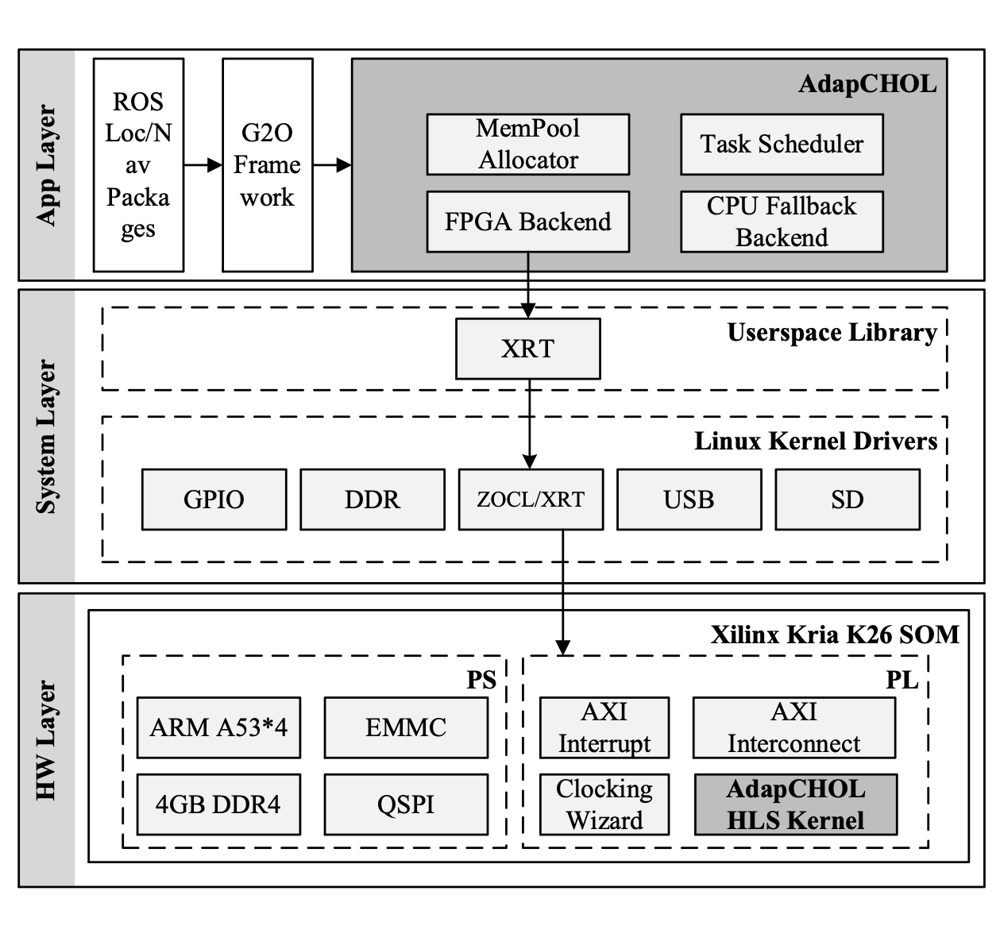

# AdapCHOL: Low-Latency Sparse Cholesky on Xilinx Kria

A latency-first sparse Cholesky factorization for **small** SPD matrices in graph-based optimization, built with HLS on Xilinx Kria (Zynq UltraScale+ MPSoC). It pipelines data load, compute, and write-back end to end and coordinates PS/PL work to cut **per-factorization latency**, delivering up to **148%** speedup over an A53 + CSparse baseline.

## Highlights

- **Latency-oriented dataflow for small matrices**  
  Streamed update with on-the-fly mask generation and in-place Extend-Add removes bulky temporaries and favors FIFO-friendly flows, reducing stalls and per-solve overhead.

- **Subtree scheduling across multiple CUs**  
  Work is dispatched over elimination-tree subtrees while respecting dependencies, scaling across compute units and keeping each CU fed without global barriers.

- **Lean coherence and memory management**  
  An AXI-aware coherence manager flushes only when required. Frontal matrices are backed by sized memory pools in host DDR to satisfy contiguous-buffer needs and recycle space efficiently.

## Architecture

## Performance

Tested on Arm Cortex-A53 + Kria at 250 MHz with representative small matrices from graph-optimization workloads. AdapCHOL achieves **~10%–148%** speedup versus CSparse on the CPU. Extremely tiny cases may still favor pure CPU due to fixed launch and sync costs.

## Integrations

- Pluggable as a linear solver in **g2o**
- Evaluated in **TEB**-style local planning loops for obstacle-avoidance.